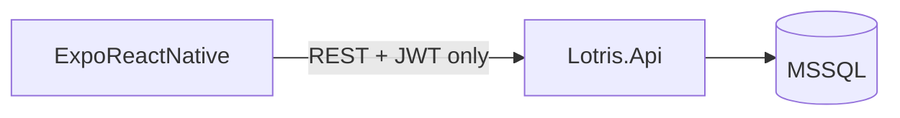

# Lotris Mobile Pager — Feasibility & Build Plan

> **Status:** Planning — architecture review (Supabase vs direct API)  
> **Audience:** Engineers + Team Leads (v1)  
> **Security priority:** Entra + MFA, MDM distribution, minimal push payloads

---

## Verdict: **Yes, build it — but skip Supabase**

A lightweight **React Native (Expo)** app talking **only to Lotris.Api** is the right shape. **Supabase does not reduce work** for this project and introduces a second platform that conflicts with on-prem, MSSQL, and existing auth.

---

## Supabase + React Native — honest assessment

### What Supabase is good at

- Greenfield apps with Postgres as the only database
- Supabase Auth + Row Level Security when the API *is* Supabase
- Realtime subscriptions on Postgres changes
- Hosted BaaS when you don't already have a backend

### Why it fits poorly here

| Supabase feature | Lotris reality | Risk if used |
|------------------|----------------|--------------|
| **Auth** | ASP.NET Identity + Entra OIDC + Lotris JWT already built ([`AuthController.cs`](src/Lotris.Api/Controllers/AuthController.cs)) | Dual identity systems; mobile users bypass Entra/MFA path IT expects |
| **Database** | MSSQL + tenant-scoped services + FSM in C# | Supabase Postgres = second source of truth; queue mutex, SLA, RBAC duplicated or bypassed |
| **Realtime** | Redis SSE today ([`NotificationsController`](src/Lotris.Api/Controllers/NotificationsController.cs)) | Subscribes to wrong store; doesn't fix background push |
| **Edge Functions** | Hangfire + [`NotificationJob`](src/Lotris.Workers/Jobs/NotificationJob.cs) | Reimplements business logic outside tested C# path |
| **On-prem** | Docker Compose, air-gap customers ([`IT-HANDOVER.md`](docs/IT-HANDOVER.md)) | Supabase Cloud = external dependency many IT teams will reject |
| **Push** | Needs FCM + APNs | Supabase is **not** a mobile push provider; you still need FCM/APNs |

### The rule that keeps the mobile app simple

**Mobile must not read or write ticket data except through Lotris.Api.**  
If Supabase sits in the middle, you either duplicate logic or sync MSSQL ↔ Postgres — both are *more* work, not less.

### When Supabase *might* make sense (not this project)

- New product with no existing backend
- Team already standardized on Supabase for everything
- Cloud-only SaaS, no on-prem

None of those apply to Lotris today.

---

## Recommended stack (minimal work, maximum reuse)

| Layer | Choice | Why |
|-------|--------|-----|
| **Mobile UI** | Expo (React Native) + TypeScript | Same language as web; one codebase iOS/Android; MDM-friendly |
| **API client** | OpenAPI codegen from [`docs/openapi/v1.json`](docs/openapi/v1.json) | Same contract as web — no parallel API |
| **Auth** | Existing Entra + `POST /api/v1/auth/login` + **new refresh tokens** | No new IdP; IT keeps MFA in Entra |
| **Push** | FCM + APNs via small C# `PushNotificationService` | Industry standard; configurable per deployment |
| **New backend surface** | ~4 endpoints only (devices, refresh, optional notification inbox) | Small slice in [`Lotris.Api`](src/Lotris.Api) |

**Do not add:** Supabase, Firebase Auth, duplicate Postgres, GraphQL layer.

Optional: **Firebase Cloud Messaging** as delivery pipe only (not Firebase Auth/Firestore) — many enterprises already allow FCM for Android; APNs for iOS is separate anyway.

---

## What already works (reuse)

- Queue: `GET /api/v1/queue`, `POST /api/v1/queue/claim/{id}`
- Tickets: list, detail, status, comments, batch reassign (leads)
- Auth providers endpoint: `GET /api/v1/auth/providers`
- Notification *types* exist in [`NotificationPayload`](src/Lotris.Application/Notifications/NotificationContracts.cs) — need **push dispatch**, not new domain events

**Gap today:** assign/escalate → SSE only; no wake-up when app closed.

---

## v1 scope (Engineers + Team Leads)

| Screen | Purpose |
|--------|---------|
| Login | Entra (primary) + identity fallback |
| Alerts | Assigned, escalated, SLA warning |
| My tickets | Active work |
| Team queue | Unclaimed + claim |
| Ticket detail | Status, comment |
| Quick assign | Team Lead batch reassign |

Out of v1: KPIs, reports, RCA, intelligence, admin.

---

## Security (enterprise / on-prem)

- Distribution: MDM or private app store — not public PWA
- Tokens: OS secure storage (Expo SecureStore)
- Push body: ticket ref only; detail after unlock
- Transport: TLS on `PUBLIC_BASE_URL`; optional cert pinning
- LDAP: VPN-only; mobile off-network uses Entra or identity

---

## Phased delivery

### Phase 1 — Foundation (2–3 weeks)

- Expo scaffold + OpenAPI client + secure token storage
- Backend: refresh tokens + device registration migration
- Screens: login, my tickets, ticket detail (status + comment)

### Phase 2 — Pager core (2–3 weeks)

- FCM/APNs dispatcher; hook [`NotificationJob`](src/Lotris.Workers/Jobs/NotificationJob.cs)
- Alerts + deep links; queue + claim; lead batch assign

### Phase 3 — Hardening (1–2 weeks)

- Biometric lock, device revoke, IT handover addendum (APNs/FCM keys, Entra mobile redirect URIs)
- MDM package / internal store submission

**Total estimate:** 5–8 weeks (1 mobile + backend slices)

---

## Alternatives ranked (effort vs value)

1. **Expo → Lotris.Api only** (recommended) — least duplication, on-prem safe
2. **Capacitor + `/mobile` routes in Next.js** — faster UI reuse; weaker push/security
3. **PWA + Web Push** — fastest; poor iOS pager + enterprise concerns
4. **Supabase + RN** — not recommended; adds platform without removing backend work
5. **Full Swift + Kotlin** — overkill for pager

---

## Next step (spike)

Before Phase 1 commit: Expo login against HTTPS Lotris API + one `PATCH …/status` — validates Entra mobile redirect URIs and edge TLS without building push yet.

---

## Plan todos

- [ ] Phase 1 spike: Expo auth against live API
- [ ] Backend: device registration + refresh tokens
- [ ] Mobile core screens (engineers + leads)
- [ ] Push dispatcher wired to NotificationJob
- [ ] Security hardening + IT handover mobile section
