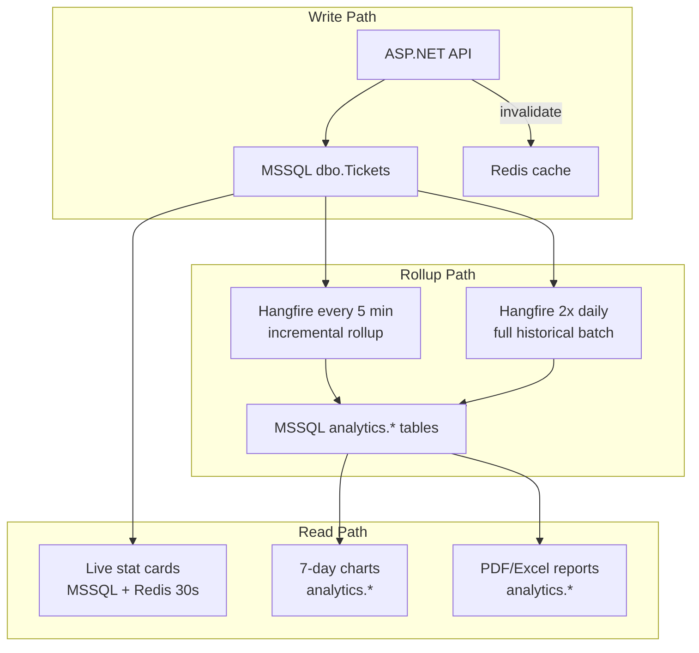

# Lotris — Database Strategy (Analytics & Reporting)

> **Status: DECIDED — Option B+ (MSSQL tiered analytics)**  
> Decided: June 2026 deep-dive session  
> Target scale: ~60 concurrent IT users (year 1 on-prem)  
> Applies to: C# refactor Phase 0+ (PostgreSQL removed from on-prem stack)

---

## Decision summary

| Layer | Engine | Freshness |
|-------|--------|-----------|
| **Operational** (tickets, queue, KPIs, tasks) | MSSQL `dbo` | Real-time |
| **Live dashboard stat cards** | MSSQL direct + Redis cache | Near real-time (~30s cache, invalidate on write) |
| **Dashboard trend charts** (7-day) | MSSQL `analytics` schema | Near real-time (1–5 min incremental rollup) |
| **KPI trend snapshots** | MSSQL `analytics` schema | Every 5–30 min (Hangfire) |
| **Scheduled/historical reports** | MSSQL `analytics` schema | 2× daily batch (08:00 + 18:00 UTC) + on-demand |
| **Report job metadata** | MSSQL `analytics` (or Hangfire tables) | Async |
| **Job queues / cache / SSE** | Redis | Real-time |

**PostgreSQL is eliminated** from the on-prem and C# target stack. Cloud staging may keep PG temporarily during strangler migration only.

---

## 1. What the codebase actually does today (important correction)

Documentation often implies "dashboards read PostgreSQL." **That is only partially true.**

### Already MSSQL + Redis (live — no Postgres)

| Endpoint | Source | File |
|----------|--------|------|
| `dashboard.summary` (stat cards) | **MSSQL** `Tickets` + `KpiResults` aggregates | `dashboard-cache.service.ts` → `getSummary()` |
| Engineer personal stats | **MSSQL** | same, `role === 'ENGINEER'` |
| Team lead summary | **MSSQL** + Redis 30s | same, `role === 'TEAM_LEAD'` |
| Queue health / list | **MSSQL** | `queue.service.ts` |
| SLA predictor | **MSSQL** active tickets | `sla-predictor.service.ts` |
| Monitor wall stats | **MSSQL** | `trpc/router.ts` → `monitor.stats` |

### Postgres-dependent (batch — this is what we migrate)

| Endpoint / job | Postgres tables | Update today |
|----------------|-----------------|--------------|
| `dashboard.ticketAnalytics` (7-day charts) | `analytics_ticket_daily`, `analytics_sla_daily` | ETL 2×/day |
| `dashboard.engineerPerf` | `analytics_engineer_perf` | ETL in API only — **worker never syncs this** (bug/gap) |
| KPI trend analysis | `kpi_trend_snapshots` | Every 30 min worker |
| PDF/Excel reports | All `analytics_*` tables | Reads PG aggregates |
| Report jobs / schedules / config | `report_jobs`, `report_schedules`, `report_config` | PG only |
| Health check | Postgres ping | Connectivity test |

**Implication:** Removing Postgres is a **bounded migration** (~8 tables, ~15 code files). The hard live path already runs on MSSQL. The gap is **freshness** — 2×/day ETL is too slow for your near-real-time dashboard requirement.

---

## 2. Requirements (locked from product session)

| Requirement | Target |
|-------------|--------|
| Concurrent users | ~60 IT users |
| Dashboard stat cards | **Near real-time** (already MSSQL — keep + tighten cache invalidation) |
| Dashboard trend charts | **Near real-time** (1–5 min stale max — upgrade from 2×/day ETL) |
| Historical / scheduled reports | **2× daily** or end-of-day batch — acceptable |
| On-prem ops | Single SQL Server footprint preferred |
| Hangfire | MSSQL job storage — same instance as operational data |

---

## 3. Chosen architecture — Option B+ (MSSQL tiered analytics)



### Tier 1 — Live reads (MSSQL operational)

- Stat cards, queue counts, open ticket lists, SLA badges
- Query `dbo.Tickets` with existing indexes (`idx_tickets_tenant_status`, `idx_tickets_queue`, etc.)
- **Redis cache** TTL 30s (consider 15s for exec dashboard); **invalidate on ticket create/update/resolve/close**
- No ETL involved — this already meets near-real-time

### Tier 2 — Near-real-time aggregates (MSSQL `analytics` schema)

Port PostgreSQL tables to MSSQL schema `analytics`:

| Table | Purpose |
|-------|---------|
| `analytics.TicketDaily` | Daily ticket volume, SLA counts |
| `analytics.SlaDaily` | Compliance % by day |
| `analytics.EngineerPerf` | Weekly engineer rollups |
| `analytics.KpiSummary` | Period KPI scores |
| `analytics.KpiTrendSnapshots` | Regression projections |
| `analytics.ReportJobs` | On-demand report status |
| `analytics.ReportSchedules` | Cron schedules |
| `analytics.ReportConfig` | Tenant report settings |

**Incremental rollup (Hangfire — default every 5 minutes, configurable):**

- Recompute **today's** row in `TicketDaily` / `SlaDaily` per tenant (same logic as current `syncTicketDay`, but MSSQL → MSSQL `MERGE`)
- Refresh **current week** in `EngineerPerf`
- Default interval: **5 minutes** — overridable by sysadmin (see [DATABASE-STRATEGY.md §11](DATABASE-STRATEGY.md))

**Why 5 minutes default:** ~60 users won't hammer aggregates; avoids running heavy `COUNT(*)` on `Tickets` on every page view while keeping trend charts within your near-real-time target.

### Tier 3 — Historical reporting (2× daily batch — configurable)

- **Default:** 08:00 + 18:00 UTC full batch
- Backfill yesterday's closed rows, reconcile weekly KPI summaries
- Batch times and enable/disable are **sysadmin-configurable** (see [DATABASE-STRATEGY.md §11](DATABASE-STRATEGY.md))
- Scheduled PDF/Excel generation reads `analytics.*` — never scans raw `Tickets` for multi-month reports
- On-demand reports: enqueue Hangfire job → read aggregates + limited MSSQL detail queries

### Redis (unchanged role)

- Dashboard cache keys: `dash:{tenantId}:summary`, etc.
- SSE pub/sub, auto-assign mutex, rate limits
- Optional: cache 7-day trend JSON for 60s to reduce repeated analytics reads

---

## 4. Why not the other options

| Option | Verdict for Lotris @ 60 users |
|--------|-------------------------------|
| **A — Keep Postgres** | Rejected — second engine on-prem for ~8 tables; ETL cross-DB hop; doesn't fix freshness without more jobs anyway |
| **C — MSSQL read replica** | Deferred — overkill at 60 users; document as enterprise upgrade if ticket volume exceeds ~500k |
| **D — Real-time only, no aggregates** | Rejected for trends/reports — 7-day charts and PDF reports need pre-aggregation at scale |

---

## 5. C# implementation plan

### Phase 0 (with scaffold)

- EF Core migrations: `dbo` operational schema + `analytics` schema on **one MSSQL database** (`lotris`)
- `IAnalyticsStore` interface in `Lotris.Application`
- `MssqlAnalyticsStore` implementation — no Npgsql package in on-prem build
- Hangfire uses same connection string

### Phase 1–3

- Operational features unchanged; analytics interface stubbed or fed by incremental job

### Phase 4 (analytics parity)

- Port ETL logic from `etl.service.ts` → Hangfire jobs (incremental + 2× daily)
- **`analytics.AnalyticsJobConfig`** table + sysadmin API/UI ([DATABASE-STRATEGY.md §11](DATABASE-STRATEGY.md))
- **`IAnalyticsJobScheduler`** — apply config changes to Hangfire `RecurringJob` registrations
- Port `dashboard-cache.service.ts` read paths to `analytics` schema
- Port `kpi-trend.service.ts` snapshots to `analytics.KpiTrendSnapshots`
- Port reports module PG reads → MSSQL
- Fix **engineer perf gap** (worker never synced — include in incremental rollup)

### Docker on-prem (Phase 6)

```yaml
# docker-compose.onprem.yml — databases
services:
  mssql:   # single instance — dbo + analytics schemas
  redis:   # required
  # postgres: REMOVED
```

### Optional cloud staging (temporary)

During strangler migration, `DATABASE_URL_POSTGRES` may remain optional behind feature flag `Analytics:Provider=Mssql|Postgres` for side-by-side validation — **remove before Phase 7**.

---

## 6. `IAnalyticsStore` contract

```csharp
public interface IAnalyticsStore
{
    // Live (Tier 1) — may delegate to ITicketRepository + cache
    Task<DashboardSummary> GetLiveSummaryAsync(LotrisSession session, CancellationToken ct);

    // Near-real-time (Tier 2)
    Task<TicketTrendSeries> GetTicketTrendAsync(Guid tenantId, int days, CancellationToken ct);
    Task<IReadOnlyList<EngineerPerfRow>> GetEngineerPerfAsync(Guid tenantId, string weekKey, CancellationToken ct);
    Task UpsertTicketDailyAsync(Guid tenantId, DateOnly date, CancellationToken ct);

    // Reporting (Tier 3)
    Task<ReportJob> EnqueueReportAsync(ReportRequest request, CancellationToken ct);
    Task<IReadOnlyList<DailyAggregate>> GetDailyRangeAsync(Guid tenantId, DateRange range, CancellationToken ct);
}
```

Single MSSQL implementation — no Postgres adapter in production.

---

## 7. Index & performance notes (MSSQL `analytics` schema)

```sql
-- Per-table (port from PG migrations)
CREATE UNIQUE INDEX IX_TicketDaily_TenantDate ON analytics.TicketDaily (tenant_id, date);
CREATE UNIQUE INDEX IX_EngineerPerf_EngineerWeek ON analytics.EngineerPerf (tenant_id, engineer_id, week_key);

-- Optional at scale (>100k tickets)
-- CREATE COLUMNSTORE INDEX CS_TicketDaily ON analytics.TicketDaily (...);
-- CREATE PARTITION FUNCTION pf_monthly ... ON analytics.TicketDaily(date);
```

**At ~60 concurrent users and moderate ticket volume:** standard B-tree indexes on `(tenant_id, date)` are sufficient. Columnstore is a documented upgrade path, not day-one requirement.

**Ticket table (operational)** — existing indexes are adequate for live dashboard queries. Monitor `COUNT(*)` on large tenants; incremental rollup prevents trend queries from hitting `dbo.Tickets`.

---

## 8. Migration from existing NestJS dev data

| Step | Action |
|------|--------|
| 1 | Export PG analytics tables to CSV (if staging data matters) |
| 2 | Import into MSSQL `analytics.*` via bootstrap script |
| 3 | Run incremental rollup to reconcile today |
| 4 | Remove Postgres from compose and env templates |

Greenfield on-prem installs skip steps 1–2.

---

## 9. Benchmark gate (lightweight — before Phase 4 code complete)

Even at decided architecture, validate on dev hardware:

1. Seed **50k tickets** single tenant
2. Measure `getSummary` p95 with Redis cold vs warm
3. Measure incremental rollup job duration (target < 10s per tenant)
4. Measure 7-day trend read from `analytics.TicketDaily` (target < 100ms)
5. Generate one PDF report for 90-day range (target < 60s async)

If rollup exceeds 30s at expected volume, reduce frequency to 10 min or add event-driven debounced refresh.

---

## 10. References in codebase (legacy NestJS)

| Asset | Path | C# port target |
|-------|------|----------------|
| Live dashboard | `apps/api/src/modules/analytics/dashboard-cache.service.ts` | Tier 1 + 2 reads |
| ETL (full) | `apps/api/src/modules/analytics/etl.service.ts` | Hangfire incremental + batch |
| ETL worker (subset) | `workers/jobs/src/etl-sync.worker.ts` | Replace with Hangfire |
| KPI trends | `apps/api/src/modules/analytics/kpi-trend.service.ts` | `analytics.KpiTrendSnapshots` |
| Reports | `apps/api/src/modules/reports/*.ts` | MSSQL analytics reads |
| PG schema SQL | `packages/db/migrations/pg/` | `src/Lotris.Infrastructure/Migrations/analytics/` |
| Ticket indexes | `packages/db/src/schemas/mssql/tickets.ts` | Keep as-is |

---

## 11. Configurable analytics & ETL jobs (sysadmin-gated)

> **Requirement (June 2026):** Rollup intervals, batch schedules, and job enable/disable must be **configurable at runtime** — not hardcoded in Hangfire registration or env-only. Only **sysadmins** (`ADMIN`, `SUPERADMIN`) may view or change these settings. Precedent: `report_config` (tenant report settings) and `sla-config.controller.ts` (ADMIN-gated SLA).

### Design principles

| Principle | Implementation |
|-----------|----------------|
| **Defaults in code** | Sensible out-of-box values (5 min rollup, 08:00/18:00 batch) — on-prem works without touching UI |
| **Runtime config in DB** | `analytics.AnalyticsJobConfig` — survives restarts; Hangfire re-registers on save |
| **Env as guardrails** | `appsettings` / env sets **min/max** bounds (e.g. rollup interval 2–60 min) — sysadmin cannot exceed platform limits |
| **RBAC** | Read/write: `ADMIN`, `SUPERADMIN` only; audit log on every change and manual run |
| **Manual run** | "Run now" per job type with **60s cooldown** (same pattern as service restart API) |
| **Multi-tenant** | Platform default row (`tenant_id NULL`) + optional per-tenant override row for SaaS; on-prem usually one platform row |

### `analytics.AnalyticsJobConfig` (new table)

| Column | Type | Description |
|--------|------|-------------|
| `id` | UUID | PK |
| `tenant_id` | VARCHAR(36) NULL | NULL = platform/on-prem global default |
| `incremental_rollup_enabled` | BIT | Tier 2 on/off |
| `incremental_rollup_interval_minutes` | INT | Default 5; bounded by env min/max |
| `daily_batch_enabled` | BIT | Tier 3 on/off |
| `daily_batch_times_utc` | NVARCHAR(JSON) | e.g. `["08:00","18:00"]` |
| `kpi_trend_scan_enabled` | BIT | Default on |
| `kpi_trend_interval_minutes` | INT | Default 30 |
| `sla_predictor_enabled` | BIT | Default on |
| `sla_predictor_interval_minutes` | INT | Default 5 |
| `dashboard_cache_ttl_seconds` | INT | Default 30; Tier 1 Redis TTL |
| `updated_at` | DATETIME2 | |
| `updated_by` | VARCHAR(36) | User id — audit |

Unique index: `(tenant_id)` where not null; single platform row where `tenant_id IS NULL`.

### Configurable job catalog

| Job key | Tier | Default | Sysadmin controls |
|---------|------|---------|-------------------|
| `incremental-rollup` | 2 | Every 5 min | Enable/disable, interval (minutes) |
| `daily-batch` | 3 | 08:00 + 18:00 UTC | Enable/disable, times (HH:mm list) |
| `kpi-trend-scan` | 2 | Every 30 min | Enable/disable, interval |
| `sla-predictor-scan` | 1 | Every 5 min | Enable/disable, interval |
| `report-schedule-processor` | 3 | Hourly | Enable/disable (interval fixed or future) |

SLA timer jobs (`pickup-sla-check`, `resolution-sla-check`) remain **event-driven** per ticket — not on this config screen.

### API (C# — OpenAPI)

| Method | Path | Auth | Action |
|--------|------|------|--------|
| GET | `/api/v1/admin/analytics-jobs/config` | ADMIN, SUPERADMIN | Current effective config (platform + tenant merge if applicable) |
| PATCH | `/api/v1/admin/analytics-jobs/config` | ADMIN, SUPERADMIN | Update config; reschedule Hangfire; write audit log |
| POST | `/api/v1/admin/analytics-jobs/{jobKey}/run-now` | ADMIN, SUPERADMIN | Enqueue immediate run; 60s cooldown per job key |
| GET | `/api/v1/admin/analytics-jobs/status` | ADMIN, SUPERADMIN | Last run time, duration, next scheduled, last error |

### UI placement

New panel on **`/system-health`** — **"Analytics & ETL Jobs"** (alongside queue depths and service table):

- Toggle per job type (enabled/disabled)
- Interval/time pickers with inline validation (show env min/max in helper text)
- Last run / next run / duration columns
- **Run now** button per job (disabled during cooldown)
- Save applies immediately + toast confirmation

Phase 5 **ui-ux-pro-max** pass: form labels, loading/error states, confirm dialog before disabling daily batch.

### Hangfire integration

```csharp
public interface IAnalyticsJobScheduler
{
    Task ApplyConfigAsync(AnalyticsJobConfig config, CancellationToken ct);
    Task RunNowAsync(string jobKey, Guid requestedByUserId, CancellationToken ct);
}
```

On `PATCH config`:

1. Validate against env bounds (`Analytics:MinRollupIntervalMinutes`, etc.)
2. Persist to `analytics.AnalyticsJobConfig`
3. `RecurringJob.AddOrUpdate` or `RemoveIfExists` per enabled flag
4. Insert `audit_logs` row: `ANALYTICS_JOB_CONFIG_UPDATED`

On app startup: load platform config → register all recurring jobs (replaces hardcoded cron in worker `index.ts` today).

### Environment guardrails (Platform Agent)

```json
"Analytics": {
  "MinRollupIntervalMinutes": 2,
  "MaxRollupIntervalMinutes": 60,
  "MinDashboardCacheTtlSeconds": 10,
  "MaxDashboardCacheTtlSeconds": 300,
  "MaxDailyBatchRunsPerDay": 4,
  "ManualRunCooldownSeconds": 60
}
```

On-prem installers set bounds in `.env.onprem.example`; sysadmin UI operates within them.

### Phase assignment

| Phase | Deliverable |
|-------|-------------|
| **0** | `AnalyticsJobConfig` entity + migration; defaults seeded on bootstrap |
| **4** | `IAnalyticsJobScheduler`, admin API, Hangfire wiring, manual run + cooldown |
| **5** | System health UI panel (ui-ux-pro-max) |
| **7** | Parity: config change reschedules jobs; audit entries verified |

---

## 12. Decision log

| Date | Decision | Rationale |
|------|----------|-----------|
| 2026-06 | **Option B+ — MSSQL tiered analytics** | ~60 users; near-real-time dashboards; 2× daily reporting OK; on-prem single-engine; Hangfire co-location; Postgres adds ops cost for 8 tables |
| 2026-06 | Incremental rollup **5 min** | Balances freshness vs OLTP load |
| 2026-06 | **Sysadmin-configurable ETL timing** | On-prem ops need tunable rollup/batch without redeploy; gated ADMIN/SUPERADMIN with env bounds |

---

_Related: [REFACTOR.md](REFACTOR.md) · [CONTEXT.md §21](CONTEXT.md)_
