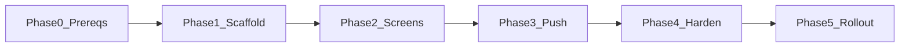

# Lotris Mobile Pager — Phased Implementation Plan

> **Document type:** Engineering implementation guide  
> **Version:** 1.0 · July 2026  
> **Status:** Proposed — follow after management approval of [`MOBILE-PAGER-SCOPE.md`](MOBILE-PAGER-SCOPE.md)  
> **Companion:** [MOBILE-PAGER-SCOPE.md](MOBILE-PAGER-SCOPE.md) (pitch) · [GLOSSARY.md](GLOSSARY.md) · [mockups/12-mobile-pager-pitch.html](../mockups/12-mobile-pager-pitch.html)

This document is the **step-by-step build plan**: prerequisites, scaffolding, API wiring, push, and rollout gates.

---

## Overview

| Phase | Focus | Duration | Exit gate |
|-------|--------|----------|-----------|
| **0** | Prerequisites & dev environment | 2–3 days | `pnpm mobile:check` green |
| **1** | Scaffold + API login spike | 1 week | Login + one ticket update from phone |
| **2** | Core screens (no push yet) | 1–2 weeks | My tickets, queue, claim, detail |
| **3** | Push notifications | 1–2 weeks | Assign/escalate/SLA wakes device |
| **4** | Team Lead + hardening | 1 week | Batch assign, biometric lock, smoke |
| **5** | Rollout & IT handover | 3–5 days | MDM package, docs updated |

**Total:** ~5–8 weeks after Phase 0.



---

## Phase 0 — Prerequisites & environment

**Goal:** This Linux workstation (and each dev machine) can run Expo and reach Lotris API from a phone.

### 0.1 Already on this machine

| Item | Status |
|------|--------|
| Node 20+ | Installed |
| pnpm 9+ | Installed |
| Docker | For MSSQL / Redis |
| Lotris API dev | `pnpm api:restart` → `:5153` |
| Expo via npx | `npx expo --version` |

Run the automated check:

```bash
pnpm mobile:check
# optional: install adb only
bash scripts/mobile-dev-prep.sh --install-adb
```

### 0.2 Install — path A (recommended first): physical phone + Expo Go

Fastest; **no Android Studio required** for the spike.

| Step | Action |
|------|--------|
| 1 | On phone: install **Expo Go** ([Android](https://play.google.com/store/apps/details?id=host.exp.exponent) / [iOS](https://apps.apple.com/app/expo-go/id982107779)) |
| 2 | Phone and PC on **same Wi‑Fi** |
| 3 | Note PC LAN IP: `hostname -I \| awk '{print $1}'` |
| 4 | API listens on all interfaces — `pnpm api:restart` binds `0.0.0.0:5153` (see `LOTRIS_API_BIND`) |
| 5 | Test from phone browser: `http://<LAN-IP>:5153/health` — should return JSON |

Mobile app env (Phase 1):

```env
EXPO_PUBLIC_API_URL=http://192.168.x.x:5153
```

Replace with your LAN IP.

### 0.3 Install — path B: Android emulator (optional, daily dev)

| Step | Action |
|------|--------|
| 1 | Download [Android Studio](https://developer.android.com/studio) (Linux .tar.gz or snap) |
| 2 | Open **SDK Manager** → install **Android SDK Platform 34+**, **Platform-Tools**, **Build-Tools** |
| 3 | **Virtual Device Manager** → create Pixel 6 / API 34 AVD |
| 4 | Add to `~/.bashrc`: |

```bash
export ANDROID_HOME=$HOME/Android/Sdk
export PATH=$PATH:$ANDROID_HOME/platform-tools:$ANDROID_HOME/emulator
```

| 5 | Verify: `adb devices` after starting emulator |
| 6 | Use **JDK 17** from Android Studio (Java 24 on host is OK for Lotris; Gradle prefers 17) |

**KVM acceleration** (you are in `kvm` group — good):

```bash
# if emulator is slow, ensure:
sudo apt install qemu-kvm
```

### 0.4 Install — path C: iOS (Linux limitation)

| Option | Notes |
|--------|-------|
| Real iPhone + Expo Go | Works on Linux dev machine (QR from `npx expo start`) |
| iOS Simulator | **Requires macOS** |
| EAS Build | Cloud build for TestFlight later (Phase 5) |

### 0.5 Lotris backend always running

```bash
docker compose -f docker/docker-compose.yml up -d mssql redis
pnpm api:restart
curl http://localhost:5153/health
```

### 0.6 Phase 0 exit checklist

- [ ] `pnpm mobile:check` — no required failures  
- [ ] Phone reaches `http://<LAN-IP>:5153/health` OR emulator boots + `adb devices`  
- [ ] Expo Go installed on test device  
- [ ] Dev login works: `admin-loose@test.local` / `Test1234!` (see [`HANDOFF.md`](HANDOFF.md))  
- [ ] Management approval recorded ([`MOBILE-PAGER-SCOPE.md`](MOBILE-PAGER-SCOPE.md) §14)

---

## Phase 1 — Scaffold & login spike

**Goal:** `apps/mobile` in monorepo; app logs in and calls one authenticated API.

### 1.1 Create Expo app

From repo root:

```bash
cd apps
npx create-expo-app@latest mobile --template blank-typescript
cd ..
pnpm install
```

Expected layout:

```
apps/mobile/
├── app/                 # Expo Router (recommended) or App.tsx
├── app.json
├── package.json         # name: @lotris/mobile
├── tsconfig.json
└── .env                 # EXPO_PUBLIC_API_URL (gitignored)
```

### 1.2 Monorepo wiring

**`apps/mobile/package.json`** — add scripts:

```json
{
  "name": "@lotris/mobile",
  "scripts": {
    "start": "expo start",
    "android": "expo start --android",
    "ios": "expo start --ios",
    "lint": "expo lint"
  }
}
```

**Root `package.json`** — add:

```json
"mobile:start": "pnpm --filter @lotris/mobile start",
"mobile:check": "bash scripts/mobile-dev-prep.sh",
"mobile:android": "pnpm --filter @lotris/mobile android"
```

### 1.3 API client

Option A (recommended): copy codegen pattern from web:

```bash
pnpm api:sync
# copy or symlink types — apps/mobile/lib/api from OpenAPI
```

Option B: minimal `fetch` wrapper with Bearer JWT in `apps/mobile/lib/lotris-api.ts`.

**Endpoints for spike:**

- `POST /api/v1/auth/login`
- `GET /api/v1/users/me`
- `GET /api/v1/tickets?assigneeId=me&status=...`

### 1.4 Secure token storage

```bash
cd apps/mobile && npx expo install expo-secure-store
```

Store `accessToken` in SecureStore — never AsyncStorage.

### 1.5 Minimal screens

| Screen | Purpose |
|--------|---------|
| `LoginScreen` | Email/password (identity dev login) |
| `HomeScreen` | Shows `users/me` + ticket count |

### 1.6 Run on device

```bash
pnpm mobile:start
# Scan QR with Expo Go
```

### 1.7 Phase 1 exit checklist

- [ ] App loads on phone via Expo Go  
- [ ] Login succeeds against `EXPO_PUBLIC_API_URL`  
- [ ] `GET /api/v1/users/me` returns profile  
- [ ] `GET /api/v1/tickets` returns list (may be empty)  
- [ ] PR merged to `dev`

---

## Phase 2 — Core screens (no push)

**Goal:** Engineer daily workflow without laptop.

### 2.1 Navigation

Use **Expo Router** tab layout:

| Tab | Screen |
|-----|--------|
| Alerts | Placeholder list (static until Phase 3) |
| My Work | Assigned / in-progress tickets |
| Queue | Team unclaimed tickets |
| Me | Profile + logout |

Match mockups: [`mockups/12-mobile-pager-pitch.html`](../mockups/12-mobile-pager-pitch.html)

### 2.2 Features

| Feature | API |
|---------|-----|
| My tickets | `GET /api/v1/tickets` |
| Ticket detail | `GET /api/v1/tickets/{id}` |
| Update status | `PATCH /api/v1/tickets/{id}/status` |
| Add comment | `POST /api/v1/tickets/{id}/comments` |
| Queue list | `GET /api/v1/queue` |
| Claim | `POST /api/v1/queue/claim/{id}` |

### 2.3 Backend (minimal for mobile sessions)

| Deliverable | Path |
|-------------|------|
| Refresh token table + migration | `packages/db/migrations/mssql/0016_refresh_tokens.sql` |
| `POST /api/v1/auth/refresh` | `AuthController` |
| Longer mobile session config | `appsettings` |

### 2.4 Phase 2 exit checklist

- [ ] Claim ticket from queue on phone  
- [ ] Move ticket IN_PROGRESS → RESOLVED with comment  
- [ ] Refresh token flow works (app restart still logged in)  
- [ ] Manual QA on Android + one iOS device (Expo Go)

---

## Phase 3 — Push notifications (pager-style)

**Goal:** Phone wakes on assign / escalate / SLA warning — **sound, vibration, and on-screen alert** like a traditional pager.

### 3.1 Pager UX (engineer experience)

| State | Behaviour |
|-------|-----------|
| **App in background / locked** | System notification: sound + vibration pattern + lock-screen banner (Android channel `lotris-pager-alerts`, iOS default sound) |
| **App in foreground** | Full-screen **Pager Alert** overlay + vibration; optional system banner |
| **Alerts tab** | In-app history of received alerts (tap → ticket detail) |
| **Payload security** | Push body = ticket reference only; detail fetched after unlock |

### 3.2 Backend

| Deliverable | Details |
|-------------|---------|
| `Device_Tokens` table | user_id, platform, token, created_at |
| `POST /api/v1/devices/register` | Body: `{ platform, token }` |
| `DELETE /api/v1/devices/{id}` | Logout / revoke |
| `ExpoPushNotificationService` | Expo push in dev; FCM/APNs path for production builds |
| Hook `NotificationJob` | After SSE, dispatch push for assign / escalate / SLA |

**Events:** `TICKET_ASSIGNED`, `TICKET_ESCALATED`, `SLA_WARNING`

### 3.3 Mobile

```bash
npx expo install expo-notifications expo-device
```

- Request permission (sound + alerts) on login  
- Android high-importance channel with vibration pattern  
- Register Expo push token → `POST /devices/register`  
- Foreground: `PagerAlertOverlay` + `Vibration.vibrate()`  
- Notification tap → deep link to ticket detail  
- **Me → Test pager alert (dev)** for UX verification without backend event  

### 3.4 Customer IT prep (parallel)

| Secret | Owner |
|--------|-------|
| FCM server key / service account | Customer IT |
| APNs key (.p8) + Key ID + Team ID | Customer IT |
| Env vars on Lotris API host | Platform team |

### 3.5 Phase 3 exit checklist

- [ ] Assign ticket → push on physical device within 60s (sound + vibrate)  
- [ ] Foreground alert shows full-screen pager overlay  
- [ ] Tap notification opens correct ticket  
- [ ] Push body has ref only (no sensitive description)  
- [ ] Logout unregisters device token  

**Note:** Remote push in **Expo Go** uses Expo push tokens. Production FCM/APNs uses a **development build**:

```bash
npx expo install expo-dev-client
npx eas build --profile development --platform android
```

Set up [EAS](https://docs.expo.dev/build/setup/) account in Phase 3.

---

## Phase 4 — Team Lead & hardening

### 4.1 Team Lead

| Screen | API |
|--------|-----|
| Quick assign | `POST /api/v1/tickets/batch-reassign` |
| Role gate | Hide tab unless `TEAM_LEAD` / `IT_MANAGER` / `ADMIN` |

### 4.2 Security

| Item | Implementation |
|------|----------------|
| Biometric lock | `expo-local-authentication` on app resume |
| Cert pinning | Optional config per deployment |
| Entra mobile login | OAuth redirect URIs in Entra app registration |

### 4.3 Tests

```bash
# new script
bash scripts/mobile-smoke.sh   # API-level: login, list, claim (future)
```

### 4.4 Phase 4 exit checklist

- [ ] Lead batch assign from phone  
- [ ] Biometric lock enabled  
- [ ] Entra login tested (staging tenant)  
- [ ] Security review sign-off  

---

## Phase 5 — Rollout & documentation

| Deliverable | Action |
|-------------|--------|
| EAS production build | `.aab` / `.ipa` for MDM |
| IT handover addendum | APNs/FCM, Entra URIs, MDM steps in [`IT-HANDOVER.md`](IT-HANDOVER.md) |
| BRD update | Mobile pager FR rows (if approved) |
| OpenAPI sync | Any new device/refresh endpoints |
| Pilot | 5–10 engineers, 2 weeks feedback |

---

## Quick reference commands

```bash
# Prerequisites check
pnpm mobile:check

# Backend
pnpm api:restart

# LAN IP for phone .env
hostname -I | awk '{print $1}'

# Start mobile (after Phase 1 scaffold)
pnpm mobile:start

# OpenAPI refresh after API changes
pnpm api:sync
```

---

## Related documents

| Doc | Purpose |
|-----|---------|
| [MOBILE-PAGER-SCOPE.md](MOBILE-PAGER-SCOPE.md) | Management pitch & investment |
| [GLOSSARY.md](GLOSSARY.md) | SSE, FCM, APNs, JWT, etc. |
| [API.md](API.md) | REST index |
| [INTELLIGENCE-ENTERPRISE-SETUP.md](INTELLIGENCE-ENTERPRISE-SETUP.md) | Entra pattern (reuse for mobile OAuth) |
| [HANDOFF.md](HANDOFF.md) | Dev credentials & API restart |

---

_Lotris Mobile Pager — Implementation Phases v1.0 — July 2026_
