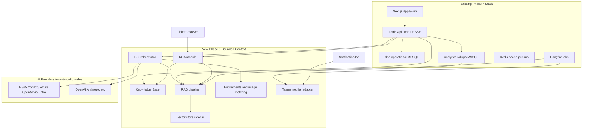
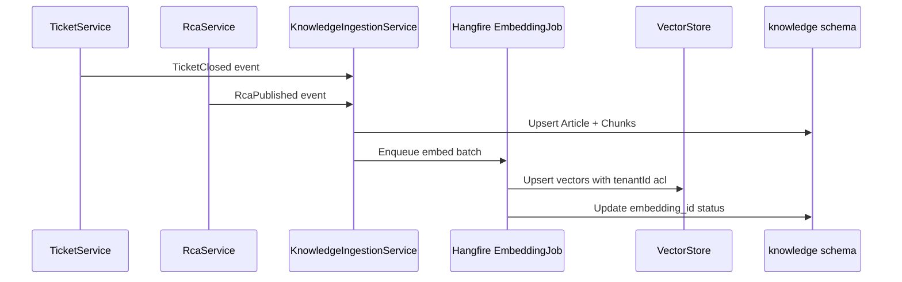
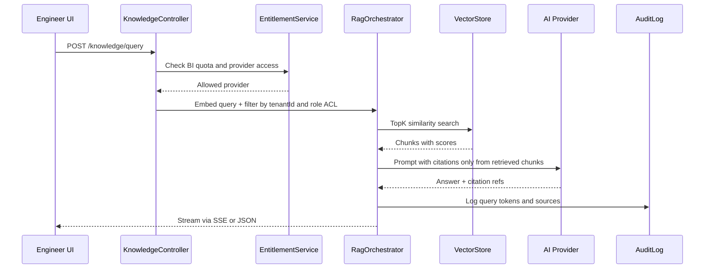

# Phase 8 — Intelligence Platform Implementation Plan

> **Status (July 2026):** Phases 8a–8d **implemented** — see [PHASE-8-UPDATES.md](PHASE-8-UPDATES.md) for the as-built changelog. This document is the original architecture reference.

> **Research basis:** [PHASE-8-UPDATES.md](PHASE-8-UPDATES.md) — QA-reviewed synthesis, ITIL/ISO/KCS aligned.

## Short answer: do we need structural change?

**Yes — but additive, not a rewrite.** Phase 7 left Lotris as a clean operational platform (tickets, KPI, analytics rollups, reports, email+SSE). None of your requested capabilities exist today:

| Capability | Today | Gap |
|------------|-------|-----|
| RCA model | `relatedTicketId` only | No root-cause entity, taxonomy, or workflow |
| Knowledge base | None | No articles, search, or ingestion |
| RAG / LLM | None | No embeddings, vector store, or provider abstraction |
| Intelligent reporting | QuestPDF/ClosedXML from `analytics.*` | No NL summaries, no RCA-aware narratives |
| Teams alerting | Email + Redis SSE only | No webhook/Graph adapter |
| BI dual-path | None | No Entra OIDC, no entitlements/billing |
| Payment gates | Out of scope v1 ([CONTEXT.md](docs/CONTEXT.md)) | No feature entitlements layer |

The **existing architecture stays**: Dapper on `dbo.*` for live ops, EF on `analytics.*`, Hangfire workers, OpenAPI + Next.js. We add a **new bounded context** — `Lotris.Knowledge` / `Lotris.Intelligence` — plus thin hooks in tickets, reports, and notifications.



---

## 1. RCA Model — how it fits tickets (updated per research)

### Domain model

Per [PHASE-8-UPDATES.md](docs/PHASE-8-UPDATES.md): split **Problem** (ITIL container) from **RCA** (investigation document). Many tickets → one problem → one active RCA → KEDB on publish.

**New `dbo` tables** (Dapper, migration `0010_problem_rca.sql`):

| Table | Purpose |
|-------|---------|
| `Problem_Records` | ITIL problem: recurrence count, service, status IDENTIFIED → CLOSED |
| `RCA_Records` | Full template: impact, detection, root cause, lessons, dual ownership (process + technical), methodology JSON, risk scores |
| `RCA_Ticket_Links` | problem_id, rca_id, ticket_id; link_type PRIMARY / RELATED / RECURRENCE |
| `RCA_Timeline_Events` | Chronological events (manual + auto from ticket history) |
| `RCA_Categories` | Seed taxonomy from Research 2 (Infrastructure/Database/Application/Process/Vendor/Security) |
| `RCA_Actions` | CAPA: CORRECTIVE vs PREVENTIVE, owner, due, VERIFIED status |
| `RCA_Approvals` | Multi-stage: TECHNICAL_REVIEW → PROBLEM_MANAGER → SERVICE_OWNER |
| `RCA_Evidence` | Attachments, comment refs, audit refs, URLs |
| `Known_Errors` | KEDB: workaround + permanent fix on publish |
| `RCA_Trigger_Rules` | Auto-create on P1/P2, SLA breach, recurrence threshold |
| `Vendor_RCA_Requests` | Phase 8c — enterprise vendor tracking |

**Ownership (Research 1 RACI):** `process_owner_id` (Incident Manager role) + `technical_owner_id` (Service Owner) — separate fields, enforced in UI.

**Ticket touchpoint:**
- On close: `RcaTriggerEvaluator` runs tenant rules → may auto-create problem + draft RCA
- Manual create/link always available from ticket detail
- Phase 8b: recurrence clustering job suggests link to existing problem

**C# layout:**
- `Lotris.Application.Rca/` — `RcaService`, FSM for RCA status (same pattern as ticket lifecycle)
- `Lotris.Infrastructure.Rca/` — `DapperRcaRepository`
- `Lotris.Api/Controllers/RcaController.cs` — CRUD, link tickets, publish to KB

**AI assist (Phase 8b, not day one):**
- On RCA draft: call `IIntelligenceService.SuggestRootCause(ticketIds[])` using ticket description + comments + history
- Output is **suggested text + confidence + source citations** — engineer must approve before publish (human-in-the-loop)

---

## 2. Intelligent Technical Knowledge Base

### What gets indexed

| Source | When indexed | ACL |
|--------|--------------|-----|
| Published RCAs | On publish | Team + Admin read; author edit |
| Resolved tickets (opt-in) | Tenant setting: auto-index closed tickets | Same as ticket visibility |
| Ticket comments (internal) | With parent ticket | Engineer/Lead scoped |
| KPI agreements + results | After period close | Manager+ |
| SLA configs, category routing | Admin reference docs | Admin |
| Generated report text summaries | After report job | Same as report role gate |

### Schema

**MSSQL metadata** (EF, `knowledge` schema — chunk pointers, not vectors):

| Table | Purpose |
|-------|---------|
| `Knowledge_Articles` | Human-readable KB page (markdown body, tags, `source_type`, `source_id`, `status`) |
| `Knowledge_Chunks` | `article_id`, `chunk_index`, `text`, `token_count`, `embedding_id`, `acl_json` |
| `Knowledge_Index_Runs` | Ingestion job audit (like `AnalyticsJobConfig`) |

**Vector store (separate service):** Qdrant or Redis Stack in [docker-compose.onprem.yml](docker/docker-compose.onprem.yml). MSSQL holds metadata + tenant ACL; vectors live externally. This preserves the MSSQL-only ops DB decision while enabling semantic search.

### Ingestion pipeline



**Chunking strategy:** ~512-token overlapping chunks; prepend metadata header (`[Ticket T-1234 | Network | P2 | 2026-03]`). Use existing [Ticket_Comments](packages/db/src/schemas/mssql/ticket-comments.ts) and [Ticket_History](packages/db/src/schemas/mssql/ticket-history.ts) as enrichment.

**API:**
- `GET /api/v1/knowledge/articles` — browse/search (keyword + semantic)
- `GET /api/v1/knowledge/articles/{id}`
- `POST /api/v1/knowledge/query` — RAG Q&A (see section 5)
- `POST /api/v1/admin/knowledge/reindex` — admin trigger (mirrors analytics-jobs pattern)

**UI:** New `/knowledge` route + RCA publish flow + ticket drawer "Similar incidents" panel.

---

## 3. Intelligent Reporting (tickets + RCA)

### Layered approach

| Layer | What | Implementation |
|-------|------|----------------|
| **Structured (existing)** | PDF/Excel from `analytics.*` | Keep [ReportGenerator.cs](src/Lotris.Infrastructure/Reports/ReportGenerator.cs) |
| **RCA-enriched** | New report types: `RCA_SUMMARY`, `RECURRING_INCIDENTS`, `KNOWLEDGE_COVERAGE` | New queries in `EfReportRepository` + Dapper RCA joins |
| **Narrative (AI)** | Executive summary paragraph, trend explanation, recommended actions | `IIntelligenceService.GenerateReportNarrative(reportType, dataSnapshot)` |

**Flow:**
1. Hangfire [ReportGenerationJob](src/Lotris.Workers/Jobs/ReportGenerationJob.cs) builds data snapshot (JSON) from analytics + RCA tables
2. If tenant has BI entitlement → call intelligence provider with **structured prompt + retrieved KB chunks** (RAG context)
3. Append "Insights" section to PDF (QuestPDF) and store narrative in `ReportJobs.insights_json`
4. Email/report download unchanged; optional Teams card with summary (section 4)

**Also fix existing gaps** (prerequisite for trustworthy reporting):
- Port scheduled report runner to Hangfire (CRUD exists, executor missing)
- Port KPI daily digest email (was in removed Node worker)

**New scheduled intelligence jobs:**
- Weekly "Recurring incident digest" → Teams + email to leads
- Monthly "Knowledge gap report" — categories with high ticket volume but zero published RCAs

---

## 4. Teams Alerting

### Adapter pattern (extend existing notification pipeline)

Today [NotificationJob.cs](src/Lotris.Workers/Jobs/NotificationJob.cs) switches on `payload.Type` → email or SSE. We add **`ITeamsNotifier`** without changing ticket/KPI trigger sites.

**Two integration modes (tenant chooses in admin):**

| Mode | Use case | Implementation |
|------|----------|----------------|
| **Incoming Webhook** | Simplest on-prem | POST Adaptive Card JSON to channel URL stored in `TenantNotificationConfig.teams_webhook_url` |
| **Graph API** | Enterprise (Entra app) | App registration with `ChannelMessage.Send`; map teams/channels per Lotris support team |

**New notification types:**
- `RCA_PUBLISHED`, `RCA_REVIEW_REQUESTED`
- `RECURRING_INCIDENT_DETECTED`
- `INTELLIGENCE_INSIGHT` (weekly digest)
- Existing `SLA_WARNING`, `KPI_WARNING` — add Teams alongside email

**Payload extension:** Add optional `TeamsChannelKey` to [NotificationContracts.cs](src/Lotris.Application/Notifications/NotificationContracts.cs); routing table maps Lotris `team_id` → Teams channel.

**Config** (on-prem env):
```
Notifications__Teams__Enabled=true
Notifications__Teams__Mode=Webhook|Graph
Notifications__Teams__Graph__TenantId=...
Notifications__Teams__Graph__ClientId=...
```

**Frontend:** Wire notification SSE ([useEventSource.ts](apps/web/hooks/useEventSource.ts) exists but unused) for in-app bell; Teams is outbound-only initially.

---

## 5. RAG on database data

### Query pipeline



**Retrieval rules (non-negotiable):**
- Every query filtered by JWT `tenant_id`
- Role-based chunk ACL: engineers never see other teams' internal comments unless Admin
- **No LLM call without retrieval** for factual questions (grounded mode default)
- Citations link back to ticket/RCA/KB article in UI

**Provider abstraction** (`Lotris.Application.Intelligence/`):

```csharp
interface IEmbeddingProvider { Task<float[]> EmbedAsync(string text); }
interface IChatProvider { IAsyncEnumerable<string> StreamAsync(ChatRequest req); }
interface IIntelligenceRouter { IChatProvider Resolve(TenantId, Feature); }
```

---

## 6. Business Intelligence — dual provider model

### Option A — Enterprise / in-house Copilot path

**Goal:** Sign in with Microsoft (Entra ID), use company-approved AI — no data leaving tenant boundary.

**Implementation:**
1. **Implement Entra OIDC** (documented in [REFACTOR.md](docs/REFACTOR.md) but not coded) — prerequisite
   - `Auth:Providers:Entra:Enabled`, OIDC middleware, map Entra groups → Lotris roles
   - Service account option for background jobs (client credentials)
2. **Azure OpenAI or M365 Copilot connector**
   - **Recommended first:** Azure OpenAI in same Entra tenant (well-defined SDK, on-prem API calls outbound to Azure)
   - **M365 Copilot Graph path:** If org has Copilot licenses, use Microsoft Graph `/copilot` endpoints where available; fallback to Azure OpenAI with same Entra token
3. **Tenant admin setting:** `Intelligence:Provider=EnterpriseCopilot`
4. **No payment gate** — assumed covered by org M365/Azure contract; Lotris only meters usage for audit
5. **Sign-in UI:** **Sign in with Microsoft** on admin panel only — never shown for External path

### Option B — External AI models + payment gates

**Goal:** Tenants without enterprise AI buy BI as add-on; usage billed or quota-limited.

**Sign-in UI:** **Provider-native OAuth** (OpenAI / Anthropic sign-in page) or API key fallback — **no Microsoft button** on External path.

**New `billing` schema (EF):**

| Table | Purpose |
|-------|---------|
| `Tenant_Plans` | FREE / PRO / ENTERPRISE |
| `Feature_Entitlements` | `BI_QUERY`, `BI_REPORT_NARRATIVE`, `RCA_AI_SUGGEST`, `EXTERNAL_LLM` |
| `Usage_Ledger` | `tenant_id`, `feature`, `tokens_in`, `tokens_out`, `provider`, `cost_micros`, `at` |
| `Payment_Gate_State` | Stripe customer id, subscription status (when Stripe integrated) |

**Gate enforcement:**
- Middleware or action filter `[RequiresEntitlement("BI_QUERY")]`
- Pre-call quota check in `EntitlementService` — reject with 402 + upgrade CTA
- External providers (OpenAI, Anthropic) only when `EXTERNAL_LLM` entitlement active
- Redis rate limit per tenant (queries/min)

**Admin UI:** `/admin/intelligence` — provider picker, API keys (encrypted at rest), usage dashboard, quota alerts.

**Phasing payment:** Phase 8a = entitlements + usage ledger + manual plan assignment (no Stripe). Phase 8c = Stripe subscription webhooks.

---

## 7. Structural changes summary

### New projects / folders

```
src/
  Lotris.Application/
    Rca/
    Knowledge/
    Intelligence/
    Entitlements/
  Lotris.Infrastructure/
    Rca/
    Knowledge/
    Intelligence/        # Qdrant client, Azure OpenAI, OpenAI adapters
    Notifications/TeamsNotifier.cs
  Lotris.Contracts/
    Rca/, Knowledge/, Intelligence/
  Lotris.Api/Controllers/
    RcaController.cs
    KnowledgeController.cs
    IntelligenceController.cs
    AdminIntelligenceController.cs
```

### Infrastructure additions

| Component | Dev compose | On-prem compose |
|-----------|-------------|-----------------|
| Qdrant (or Redis Stack vectors) | Optional profile | `docker-compose.onprem.yml` service |
| Ollama (air-gap fallback) | Optional profile | Optional for no-cloud tenants |
| Entra app registration | N/A | Customer-provided |

### What we deliberately do NOT change

- Ticket FSM, queue mutex, tenant isolation patterns
- Dapper for `dbo` operational reads
- OpenAPI-first contract with frontend codegen
- MSSQL as single source of truth for metadata

---

## 8. Frontend surfaces

| Route / component | Purpose |
|-------------------|---------|
| `/rca`, `/rca/[id]` | RCA list, editor, review workflow |
| `/knowledge` | KB browser, semantic search |
| `/insights` or copilot drawer | NL Q&A with citations (global + ticket context) |
| Ticket detail → "Similar" + "Suggest RCA" | RAG-powered |
| `/reports` → "Generate with insights" toggle | AI narrative add-on |
| `/admin/intelligence` | Provider config, entitlements, Teams mapping |
| Notification bell | Subscribe to `/api/v1/notifications/sse` |

---

## 9. Phased delivery (for discussion)

| Phase | Scope | Depends on | Est. |
|-------|-------|------------|------|
| **8a — Foundation** | Problem + RCA module (template, CAPA, approvals, triggers, timeline, KEDB); Teams webhook; keyword search; entitlements schema (manual plans) | None | 4–5 wks |
| **8b — RAG** | Vector sidecar; ingestion jobs; semantic search; ticket similarity; grounded Q&A with one provider (Azure OpenAI OR Ollama) | 8a | 3–4 wks |
| **8c — Intelligent reporting** | Narrative reports; recurring incident detection; scheduled digests; fix report scheduler | 8b | 2–3 wks |
| **8d — BI dual-path** | Entra OIDC; enterprise vs external router; usage ledger; payment gate UI; optional Stripe | 8b | 3–4 wks |

**Recommended build order:** RCA → KB (manual) → Teams → RAG → AI assist → reporting narratives → entitlements/payment.

---

## 10. Decisions to align on before coding

1. **Vector store:** Qdrant sidecar (recommended for on-prem) vs Redis Stack vectors vs Azure AI Search (hybrid cloud)?
2. **Enterprise AI path:** Azure OpenAI with Entra service principal first, or direct M365 Copilot Graph integration?
3. **Air-gap policy:** Must external LLM be disabled by default in on-prem compose (`AI__Provider=Disabled` until configured)?
4. **RCA workflow:** Who can publish to KB — engineer, lead only, or approval chain?
5. **Ticket auto-indexing:** Index all closed tickets or only those linked to RCAs / opt-in flag?
6. **Payment model:** Usage-based token billing vs flat PRO tier vs seat-based?
7. **Teams default:** Incoming webhook only for v1, or Graph from day one?

---

## 11. Risks and mitigations

| Risk | Mitigation |
|------|------------|
| LLM hallucination on IT incidents | Grounded RAG-only mode; citations required; human approval on RCA publish |
| Tenant data leakage via vectors | `tenant_id` + role ACL on every chunk; integration tests for isolation |
| Entra not implemented yet | Option A blocked until OIDC lands; ship Option B + Ollama for on-prem first |
| Scope creep | Strict phase gates; 8a delivers value without any LLM |
| Cost runaway (external AI) | Usage ledger + hard quotas + Redis rate limits |

---

## 12. Verification strategy

- **Unit:** RCA FSM, chunk ACL filter, entitlement checks
- **Integration:** Tenant A cannot retrieve Tenant B vectors; RCA publish → KB article → searchable
- **Gate scripts:** `pnpm gate:intelligence` — semantic search returns cited ticket; Teams webhook mock receives SLA alert
- **Manual:** Engineer resolves ticket → creates RCA → publishes → copilot answers "how did we fix X before?" with citation
