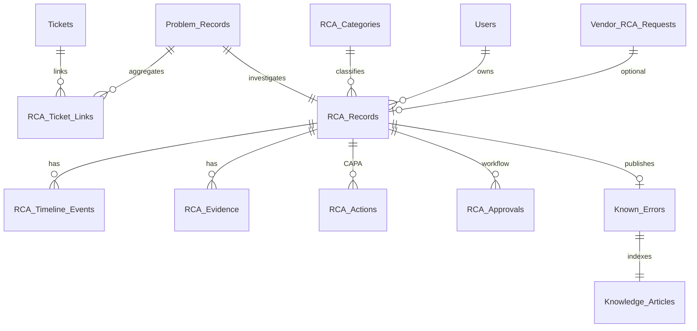
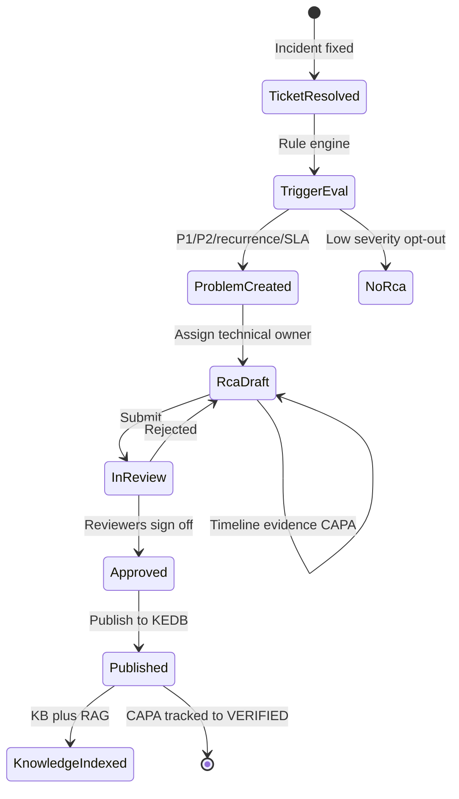
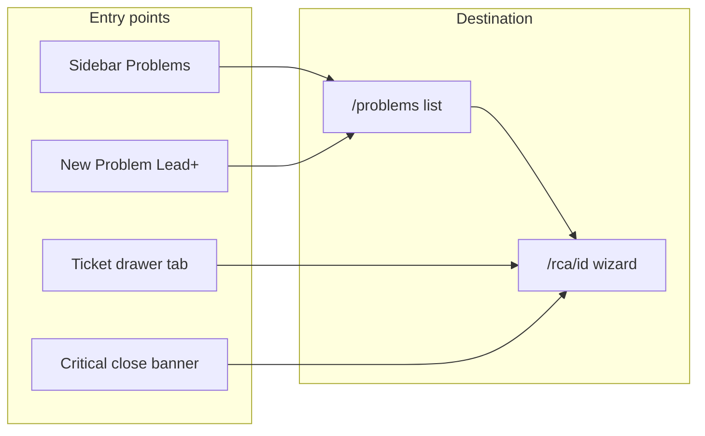

# Phase 8 — RCA & Intelligence Platform Research (Final)

> **Status:** QA-reviewed synthesis of Research 1 + Research 2  
> **Date:** July 2026  
> **Sources:** [RCA_RESEARCH_RAW.md](RCA_RESEARCH_RAW.md), ITIL 4 Problem Management, ISO/IEC 20000, KCS, existing Lotris architecture  
> **Companion:** [Phase 8 implementation plan](/home/use01/.cursor/plans/phase_8_intelligence_platform_8fd0f6e6.plan.md)

---

## 1. Executive summary

Research 1 and Research 2 describe the same enterprise RCA vision from slightly different angles. After deduplication and QA against industry standards and the current Lotris codebase (Phase 7 complete), the recommendation is:

1. **Build RCA as an ITIL-aligned Problem Management module** — not a free-text field on tickets.
2. **Ship a structured, governance-ready core first (Phase 8a)** — template, linking, CAPA, approvals, KEDB — **without AI or CMDB dependencies**.
3. **Layer intelligence on proven data (Phase 8b–8d)** — similar-incident search, AI drafts, narrative reporting, Teams alerts, dual BI providers.
4. **Defer integrations Lotris does not have today** — CMDB, monitoring/log auto-ingest, change-management systems — behind adapter interfaces.

This moves Lotris from ticket tracking to **operational learning**, matching banking/enterprise expectations while staying implementable on the existing C# + MSSQL + Hangfire stack.

---

## 2. QA review of raw research

### 2.1 Overlap and deduplication

| Theme | Research 1 | Research 2 | Merged priority |
|-------|------------|------------|-----------------|
| Structured RCA template | §1 | §3 Guided wizard | **P0 — Must** |
| Incident ↔ RCA linking | §11 Problem mgmt | §2 Multi-incident link | **P0 — Must** |
| Root cause taxonomy | §3 | §7 (richer, DB-focused) | **P0 — Must** (use R2 taxonomy as seed) |
| RCA root cause capture | §4 multi-method | §4 multi-method | **P0 — Single brief form** (no 5 Whys / Fishbone picker) |
| Timeline builder | §2 | §6 | **P1 — Should** |
| Evidence repository | §5 auto + manual | §5 manual attach | **P0 manual; P2 auto** |
| CAPA action tracking | §10 | §8 Corrective vs Preventive | **P0 — Must** |
| Approval workflow | §12 | §11 governance | **P0 — Must** |
| KEDB / knowledge | §9 | §10 Known Error DB | **P0 — Must** (publish pipeline) |
| AI-assisted RCA | §7 | §13 | **P1 — Phase 8b** (human-in-the-loop) |
| Similar incident search | §8 | §13 | **P1 — Phase 8b** (RAG) |
| Analytics dashboard | §14 | §14 Management dashboard | **P1 — Phase 8c** |
| Notifications | §19 | (implicit) | **P0 Teams/email Phase 8a** |
| Vendor RCA tracking | — | §12 | **P2 — Enterprise option** |
| CMDB / CI linking | §17 | §2 affected servers | **P3 — Adapter later** |
| Auto evidence (logs, alerts) | §5–6 | — | **P3 — Requires integrations** |
| Executive report export | — | §15 PDF/Word/PPT | **P1 — QuestPDF first** |
| Ownership / RACI | §228–297 (detailed) | §11 action owners | **P0 — Must** (R1 is authoritative) |

**QA finding:** Research 2’s banking references (ABG framework, Access Bank, Nsano vendor example) are **context for severity/governance**, not Lotris requirements. Generalize as **configurable RCA trigger rules per tenant**.

**QA finding:** Research 1’s “system automatically creates RCA” is correct for enterprise maturity but must be **rule-driven and overridable** — not every resolved ticket needs an RCA.

### 2.2 Industry standards alignment

| Standard | Requirement | Lotris mapping |
|----------|-------------|----------------|
| **ITIL 4 Problem Management** | Problem record, root cause, workaround, known error, link to incidents | `Problem_Records` + `RCA_Records` + `Known_Errors` |
| **ITIL 4 Continual Improvement** | Lessons learned, preventive actions tracked to completion | CAPA table + overdue escalation |
| **ISO/IEC 20000** | Documented RCA for major incidents, review and approval | Multi-stage approval + audit log |
| **KCS (Knowledge-Centered Service)** | Knowledge created during workflow, not after | Publish to KB on approval; searchable immediately |
| **CAPA (quality)** | Separate corrective vs preventive actions with verification | `RCA_Actions.action_type` + `verified_at` |
| **Post-incident review (PIR)** | Timeline, impact, detection method | Structured template sections |

### 2.3 Gap vs current Lotris (Phase 7)

| Research assumes | Lotris today | Implication |
|------------------|--------------|-------------|
| Monitoring alerts, AWR, deployment history | Ticket history, comments, attachments, audit logs only | Phase 8a: manual evidence + ticket auto-attach; Phase 8c+: integration adapters |
| CMDB / CIs | Teams, category routing, no CI model | Optional `affected_assets` JSON field; CMDB adapter later |
| Change management system | None | Link field `external_change_ref` until integrated |
| Problem Manager role | Roles: ENGINEER, TEAM_LEAD, IT_MANAGER, ADMIN | Map RACI to existing roles (see §4) |
| M365 Copilot / vendor AI | Not implemented | Phase 8d dual provider path |

---

## 3. Target domain model (industry-aligned)

### 3.1 Entity relationship



**Design decision:** Split **Problem** (ITIL container for recurring issue) from **RCA** (investigation document). One problem → one active RCA → many linked tickets. Simpler alternative (single table) rejected because banking audits expect distinct problem IDs and RCA revision history.

### 3.2 Core tables (`dbo` — Dapper migrations)

#### `Problem_Records`
| Column | Notes |
|--------|-------|
| `id`, `tenant_id`, `problem_ref` | e.g. `PRB-2026-0042` |
| `title`, `status` | IDENTIFIED → UNDER_INVESTIGATION → ROOT_CAUSE_IDENTIFIED → CLOSED |
| `priority`, `recurrence_count` | Updated by linker job |
| `primary_service`, `primary_category_id` | For trending |
| `created_at`, `closed_at` | |

#### `RCA_Records`
| Column | Notes |
|--------|-------|
| `id`, `tenant_id`, `rca_ref`, `problem_id` | |
| `status` | DRAFT → IN_REVIEW → APPROVED → PUBLISHED → ARCHIVED |
| **Root cause (single brief form — no methodology picker)** | |
| `immediate_cause` | What failed / what was observed (1–2 sentences) |
| `root_cause_statement` | Required — the actual root cause |
| `contributing_factors` | Optional JSON array or textarea — bullets, not a 5 Whys chain |
| **Template sections** | |
| `incident_summary` | What happened |
| `business_impact` | Customers, financial, regulatory, services affected |
| `detection_method` | Monitoring, user report, etc. |
| `timeline_summary` | Auto-generated from events |
| `root_cause_statement` | Required before submit |
| `contributing_factors` | JSON array |
| `resolution_summary` | |
| `lessons_learned` | |
| **Ownership** | |
| `process_owner_id` | Incident Manager (coordination) |
| `technical_owner_id` | Service / team lead (content) |
| `review_due_at`, `published_at` | SLA on RCA completion |
| **Risk** | |
| `likelihood_recurrence`, `impact_score`, `risk_score` | 1–5 scales |
| **Classification** | |
| `category_id`, `severity` | P1–P4 or tenant scale |

#### `RCA_Ticket_Links`
| Column | Notes |
|--------|-------|
| `problem_id`, `rca_id`, `ticket_id` | |
| `link_type` | PRIMARY, RELATED, RECURRENCE |
| `downtime_minutes`, `customer_impact_note` | Per incident contribution |

#### `RCA_Timeline_Events`
| Column | Notes |
|--------|-------|
| `rca_id`, `occurred_at`, `event_type`, `description` | |
| `source` | MANUAL, SYSTEM (from ticket history), AI_SUGGESTED |
| `sort_order` | |

#### `RCA_Categories` (tenant seed + custom)
Seed from Research 2 taxonomy:
- Infrastructure → Storage, Network, OS, Server
- Database → Blocking, Deadlock, Log growth, Corruption, Capacity
- Application → Coding defect, Release issue, API failure
- Process → Missing SOP, Change failure, Human error
- Vendor → Third-party outage, Support delay
- Security → Security incident

#### `RCA_Actions` (CAPA)
| Column | Notes |
|--------|-------|
| `rca_id`, `action_type` | CORRECTIVE, PREVENTIVE |
| `description`, `owner_id`, `due_at`, `priority` | |
| `status` | OPEN, IN_PROGRESS, COMPLETED, VERIFIED, CANCELLED |
| `verified_by_id`, `verified_at` | Required for closure |
| `external_change_ref` | Future change-mgmt link |

#### `RCA_Approvals`
| Column | Notes |
|--------|-------|
| `rca_id`, `stage` | TECHNICAL_REVIEW, PROBLEM_MANAGER, SERVICE_OWNER, CAB |
| `reviewer_id`, `status`, `comments`, `decided_at` | |

#### `RCA_Evidence`
| Column | Notes |
|--------|-------|
| `rca_id`, `evidence_type` | ATTACHMENT, TICKET_COMMENT, AUDIT_LOG, URL, TEXT |
| `source_ref`, `storage_key`, `caption` | Reuse `Attachment_Refs` pattern |

#### `Known_Errors` (KEDB)
| Column | Notes |
|--------|-------|
| `id`, `tenant_id`, `rca_id` | Created on publish |
| `title`, `error_description`, `workaround`, `permanent_fix` | |
| `status` | ACTIVE, RETIRED |
| `search_keywords` | |

#### `RCA_Trigger_Rules` (tenant config)
| Column | Notes |
|--------|-------|
| `tenant_id`, `rule_type` | PRIORITY, SLA_BREACH, RECURRENCE, SECURITY, MANUAL_ONLY |
| `threshold_json`, `auto_create_problem` | e.g. P1/P2, 3 occurrences / 90 days |

#### `Vendor_RCA_Requests` (Phase 8c — enterprise)
| Column | Notes |
|--------|-------|
| `rca_id`, `vendor_name`, `requested_at`, `due_at`, `received_at` | |
| `status`, `quality_review_notes` | AWAITING, RECEIVED, ACCEPTED, REJECTED |

### 3.3 Knowledge schema (EF — unchanged from plan)

Published RCAs and Known Errors flow into `knowledge.Knowledge_Articles` + vector chunks (Phase 8b).

---

## 4. Ownership model (from Research 1 — adopted)

| ITIL role | Lotris role mapping | Accountability |
|-----------|---------------------|----------------|
| Incident Manager | `IT_MANAGER` or assigned `TEAM_LEAD` | Ensures RCA initiated, deadlines met, process |
| Technical / Service Owner | `TEAM_LEAD` or senior `ENGINEER` on affected team | Investigation content, root cause accuracy |
| Subject Matter Experts | Any `ENGINEER` (mentioned in comments, @assign) | Evidence and diagnostics |
| Problem Manager | `IT_MANAGER` / `ADMIN` | Quality review, trend analysis, CAPA completion |
| Service Owner (approval) | `IT_MANAGER` + configurable `ADMIN` for P1 | Approves publish to KEDB |
| Action owners | Any user with assignable role | Individual CAPA items |

**Rule:** Incident Manager coordinates; they do **not** own technical root cause text. Separation is enforced in UI (two owner fields on every RCA).

---

## 5. End-to-end workflow (gold standard)



**Automatic steps (Phase 8a):**
- On ticket close: evaluate `RCA_Trigger_Rules`
- Create `Problem_Record` + draft `RCA_Record` when triggered
- Pre-link triggering ticket; attach ticket history + comments as evidence stubs
- Notify process owner + technical owner (email + Teams)

**Automatic steps (Phase 8b+):**
- AI draft: timeline summary, suggested root cause, similar incidents (citations only)
- Recurrence job: cluster tickets → suggest link to existing problem

**Human gates (non-negotiable):**
- Root cause statement required before `IN_REVIEW`
- Minimum one approver for P1/P2 (configurable)
- AI content never auto-published

---

## 6. Feature prioritization (MoSCoW for Lotris)

### Must — Phase 8a (weeks 1–4)
- Structured RCA template (all Research 1 §1 + Research 2 §3 sections)
- Problem + RCA entities with FSM
- Multi-incident linking + recurrence counter
- Category taxonomy (seed + custom)
- CAPA with corrective/preventive + overdue tracking
- Multi-stage approval workflow
- RACI ownership fields
- RCA trigger rules (P1/P2, SLA breach, recurrence threshold)
- Manual evidence attach (files, URLs, ticket comment refs)
- Timeline builder (manual events)
- Known Error creation on publish → KB article (markdown)
- Keyword search on RCA/KEDB repository
- Notifications: RCA assigned, review requested, action overdue, published
- Teams webhook adapter (extends existing `NotificationJob`)
- RCA SLA metrics: time to start, time to complete, overdue actions

### Should — Phase 8b (weeks 5–8)
- Similar incident search (embeddings on tickets + published RCAs)
- AI suggest: root cause draft, timeline summary, preventive actions (review required)
- Auto-timeline from `Ticket_History` timestamps
- Engineer ticket drawer: “Similar incidents” + “Link to problem”
- `/knowledge` semantic search + grounded Q&A

### Could — Phase 8c (weeks 9–11)
- Management RCA dashboard (top causes, MTTR, recurrence, CAPA traffic light)
- Executive RCA PDF (QuestPDF — summary, timeline, impact, CAPA)
- Intelligent report narratives (analytics + RCA combined)
- Vendor RCA request tracking
- Weekly recurring-incident digest → Teams
- Scheduled report runner fix (existing gap)

### Won’t (v1) — future adapters
- Full CMDB / CI graph
- Auto-ingest monitoring (Datadog, Grafana), deployment pipelines, config snapshots
- Visual Fishbone / fault tree diagram editor
- CAB calendar integration
- Word/PowerPoint export (PDF sufficient v1)

---

## 7. Analytics & KPIs (Problem Management)

New rollup targets in `analytics` schema (Hangfire jobs):

| Metric | Definition | Source |
|--------|------------|--------|
| RCA completion rate | Published / required | Trigger rules vs published |
| Mean time to start RCA | Close → first RCA edit | Timestamps |
| Mean time to complete RCA | Create → publish | RCA_Records |
| Recurrence rate | Same category within 90 days | Problem_Records |
| Top root causes | By category | RCA_Records |
| Open overdue CAPA | Actions past due | RCA_Actions |
| Repeat incident rate | Linked tickets per problem | RCA_Ticket_Links |
| KEDB coverage | Categories with KE vs ticket volume | Join analytics |

Aligns with existing KPI engine patterns in `src/Lotris.Infrastructure/Analytics/`.

---

## 8. Intelligence & reporting integration

| Capability | Input data | Output |
|------------|------------|--------|
| Similar incident search | Ticket title, description, category, error tokens | Ranked tickets + published RCAs |
| AI RCA draft | Linked tickets, comments, history, similar RCAs | Suggested sections + citations |
| Executive summary | Approved RCA JSON snapshot | PDF section + Teams adaptive card |
| Recurring incident report | Problem_Records + analytics | Weekly email/Teams |
| RAG copilot | KEDB + published RCAs + opt-in closed tickets | Answer with mandatory citations |

**Provider paths (unchanged from plan):**
- **Enterprise:** Entra SSO + Azure OpenAI / M365 Copilot (tenant contract)
- **External:** OpenAI/Anthropic with entitlements + usage ledger + payment gate

---

## 9. Recommended implementation path

### Step 0 — Design sign-off (this document)
- Confirm Problem vs RCA split
- Confirm RACI → Lotris role mapping
- Confirm trigger rules defaults (P1/P2 mandatory RCA?)
- Confirm taxonomy seed list

### Step 1 — Phase 8a backend
- Migration `0010_problem_rca.sql`
- `Lotris.Application.ProblemManagement/` + `Lotris.Infrastructure.ProblemManagement/`
- FSM: `RcaLifecycleService`, `ProblemLifecycleService`
- `RcaController`, `ProblemsController`, `KnownErrorsController`
- Hook `TicketService` on close → `RcaTriggerEvaluator`
- Extend `NotificationJob` + `ITeamsNotifier`
- OpenAPI sync + integration tests (tenant isolation, FSM)

### Step 2 — Phase 8a frontend
- `/problems`, `/rca/[id]` wizard (sectioned form)
- Ticket detail: problem link panel, “Create RCA” CTA
- `/knowledge` read-only KEDB browser
- Admin: `/admin/rca-settings` trigger rules + taxonomy

### Step 3 — Phase 8b intelligence
- Qdrant sidecar + `knowledge` schema
- Ingest on publish; similar search API
- AI suggest endpoints behind `RCA_AI_SUGGEST` entitlement

### Step 4 — Phase 8c reporting & dashboards
- RCA analytics rollups + dashboard widgets
- Executive RCA PDF report type
- Fix scheduled report Hangfire job

### Step 5 — Phase 8d enterprise BI
- Entra OIDC
- Dual provider router + billing schema

---

## 10. Locked decisions (stakeholder sign-off)

| # | Decision | Resolution |
|---|----------|------------|
| 1 | **Sidebar placement** | **Problems + Knowledge** between Tasks and KPIs (trust UX: separates active work from published knowledge) |
| 2 | **Wizard vs modal** | **Full-page wizard** at `/rca/[id]` — drawer is entry/read-only for engineers |
| 3 | **Who can create/link RCA** | **TEAM_LEAD, IT_MANAGER, ADMIN, SUPERADMIN** — engineers view + contribute evidence; **per-RCA delegate** can edit one investigation (see §10.2) |
| 4 | **CAPA overdue visibility** | **Dashboard widget + ticket drawer tab** (when ticket linked to problem with open CAPA) |
| 5 | **Mandatory RCA scope** | **P1 (Critical) auto-trigger only** — all else manual (Lead+) or optional admin toggles |
| 6 | **Approval chain** | Team Lead technical review → IT Manager sign-off; Admin for P1 (Critical) |
| 7 | **Closed ticket RAG indexing** | KEDB + published RCAs only (not all closed tickets) |
| 8 | **AI default (on-prem)** | Disabled until tenant configures provider |

**Still open:** Vendor RCA module timing (8c vs 8a); vector store (Qdrant recommended).

### 10.1 RCA trigger policy — reducing RCA fatigue

**Principle:** RCA is for **organizational learning**, not compliance on every closure. Auto-trigger only when impact warrants formal investigation.

Lotris priority scale: `1 = CRITICAL`, `2 = HIGH`, `3 = MEDIUM`, `4 = LOW`.

#### Default tenant rules (shipped in 8a, editable in `/admin/rca-settings`)

| Rule | Auto-create Problem + draft RCA? | Rationale |
|------|----------------------------------|-----------|
| **P1 (Critical) closed** | **Yes — always (locked default)** | Only fatal/critical incidents — stakeholder sign-off |
| **P2 (High) closed** | **No** | Optional toggle in admin for regulated tenants only |
| **P2 + SLA resolution breached** | **No by default** | Optional toggle — off unless tenant enables |
| **P3 / P4 closed** | **No** | Routine tickets — no RCA noise |
| **Recurrence: 3+ tickets same category in 90 days** | **Suggest link only** — no auto-create | Prompt Lead+ to link existing problem; no new RCA unless manual |
| **Security category / tag** | **No by default** | Optional toggle in admin |
| **Manual create by Lead+** | **Always allowed** | Edge cases, vendor incidents, proactive problems |

#### What engineers see (no create permission)

On **P3/P4 close:** no banner, no draft — drawer tab shows "No RCA required" + **Similar incidents** + **Search knowledge** only.

On **P1 close:** orange banner "RCA required — draft created" but engineer **cannot** open wizard to edit — sees assigned owners; can add evidence via comments tagged `#rca-evidence`.

On **P1/P2 with linked problem:** drawer shows **CAPA overdue** chip if any linked action is past due (feeds dashboard widget too).

#### Trigger evaluator logic (backend)

```
ON ticket.status → CLOSED:
  IF priority = 1 (CRITICAL) → create Problem + draft RCA, notify process + technical owner
  ELSE IF recurrence_count(category, 90d) >= 3 → notify Lead+ to link existing problem (no auto-create)
  ELSE → no auto-create; log "RCA not required"
```

Optional admin toggles (all **off** by default): P2 close, P2+SLA breach, security category auto-create.

**Recurrence without new RCA:** When 3rd similar ticket closes, system prompts Lead+ to **link to existing problem** rather than spawning duplicate RCAs.

#### Recommended defaults for first deployment

| Setting | Default |
|---------|---------|
| Auto RCA on P1 (Critical) | **On (only auto trigger)** |
| Auto RCA on P2 (High) | Off |
| Auto RCA on P2 + SLA breach | Off |
| Auto RCA on security category | Off |
| Recurrence threshold | 3 tickets / 90 days — **link suggestion only** |
| RCA completion SLA | 5 business days from incident close |
| Manual create (Lead+) | On |

This typically yields RCAs on **~1–3% of tickets** (Critical only + manual), not 100%.

### 10.2 RCA delegate — engineer promotion (not overkill)

**Recommendation: add scoped delegation, not global role promotion.**

| Approach | Verdict |
|----------|---------|
| Promote engineer to Team Lead globally | **Overkill** — wrong RBAC scope |
| Assign engineer as **RCA delegate** on one problem/RCA | **Right size** — common in IT (subject-matter expert owns the write-up) |

**How it works:**
- Lead+ assigns `rca_delegate_id` on a specific RCA (dropdown of team engineers)
- Delegate can edit **that RCA wizard only** — not create new problems, not approve/publish
- Lead+ retains technical owner accountability; delegate is "investigator author"
- Audit log records delegate edits
- Optional: auto-suggest delegate = ticket assignee on P1 auto-create

**UI:** Context panel on wizard → "Investigator (delegate)" with Assign button (Lead+ only). Engineer with delegate sees wizard edit buttons; others remain read-only.

**Phase:** Ship in **8a** — small schema field + permission check, high practical value.

### 10.3 Intelligence & Copilot admin (Phase 8d — mock included for sign-off)

**Route:** `/admin/intelligence` (IT_MANAGER, ADMIN, SUPERADMIN)

Not in RCA wizard — separate admin surface for BI provider setup.

**Auth routing (locked):**

| Provider path | Sign-in UI | Never use |
|---------------|------------|-----------|
| **Enterprise (internal)** | **Sign in with Microsoft** only — Entra OIDC → Azure OpenAI / M365 Copilot in tenant | External provider OAuth |
| **External AI** | **Provider-native sign-in** — redirect to OpenAI / Anthropic (or similar) account linking; API key fallback | Microsoft sign-in button |

Selecting a provider path **swaps the connection panel** below the cards — Microsoft block hidden when External is selected, and vice versa.

| Section | Purpose |
|---------|---------|
| **Provider path** | Cards: Enterprise (in-house) vs External AI (payment gate) — mutually exclusive connection UI |
| **Enterprise panel** | "Sign in with Microsoft" (Entra); connected tenant; Azure OpenAI endpoint + deployment |
| **External panel** | Provider picker (OpenAI, Anthropic, …); **"Connect account"** → provider OAuth/sign-in page; encrypted API key optional fallback |
| **Feature toggles** | RCA AI suggest, Knowledge copilot, Report narratives — each bound to active provider |
| **Usage dashboard** | Tokens/queries this month (audit + payment gate for External only) |

**End-user experience:** Engineers stay on Lotris login. **Admin** completes org-level connection once per path — Microsoft for internal, provider sign-in for external. Copilot features route through whichever path is active and entitled.

---

## 11. Verification & acceptance criteria

| Gate | Test |
|------|------|
| Trigger | P1 (Critical) close → draft RCA; P3 close → no RCA |
| Isolation | Tenant A cannot read Tenant B RCA |
| FSM | Invalid status transitions rejected |
| CAPA | RCA cannot publish with open unverified preventive actions (configurable) |
| KEDB | Publish → searchable KB article + Known Error record |
| Approval | Rejected review returns to DRAFT with comments |
| Teams | Webhook receives RCA_ASSIGNED adaptive card |
| AI (8b) | Suggestion includes citation IDs; no auto-publish |
| Analytics (8c) | Dashboard shows top root cause for period |

---

## 13. UI & UX specification

> **Interactive mock:** [`mockups/11-rca-phase8-flow.html`](../mockups/11-rca-phase8-flow.html) — 8-screen flow (`⑧ Admin config` = Intelligence & Copilot). Sticky nav + Lead+/Engineer role toggle.

### 13.1 Navigation model (locked)

**Two new top-level sidebar items** (after Tasks, before KPIs):

| Nav item | Route | Badge | Who sees it |
|----------|-------|-------|-------------|
| **Problems** | `/problems` | Open RCAs needing action | All roles (scoped); **edit: Lead+** |
| **Knowledge** | `/knowledge` | — | All roles (read) |

RCA editing is **not** a sidebar item — full-page wizard at `/rca/[id]`.

### 13.2 Entry points (updated for role gates)

| Entry | Who | Behaviour |
|-------|-----|-----------|
| Sidebar → Problems | All | Engineers: read linked RCAs, filters; Lead+: create/edit |
| Ticket drawer tab | All | Engineers: view banner, similar, knowledge search, add evidence |
| Auto banner on close | All (view) | **P1 (Critical) only** by default — see §10.1 |
| Problems → New Problem | **Lead+ only** | Manual problem/RCA creation |
| Drawer → Create / Link | **Lead+ only** | Hidden or disabled for ENGINEER role |



### 13.3 Page inventory & CAPA visibility (locked)

| Surface | CAPA overdue |
|---------|----------------|
| **Dashboard** | Stat card: "Overdue RCA actions" + link to Problems filter |
| **Ticket drawer** | Amber chip on Problem/RCA tab when linked CAPA overdue |
| **Problems list** | Filter chip: "Overdue CAPA" |

| Route | Layout | Purpose |
|-------|--------|---------|
| `/problems` | Table + filter chips | Registry: status, linked tickets, dual owners, due dates, recurrence pill |
| `/rca/[id]` | **3-column wizard** | Primary edit surface — **Lead+ edit** (see §13.4) |
| `/knowledge` | Card list + search | KEDB browse; workaround + permanent fix prominent |
| `/knowledge/[id]` | Article detail | Full RCA read-only + "Ask about this" (8b) |
| `/admin/rca-settings` | Admin form | Trigger rules (§10.1), taxonomy, Teams channel map |
| `/admin/intelligence` | Admin form | Enterprise Microsoft connect, external AI keys, feature toggles (§10.3) |
| Ticket drawer tab | Right drawer panel | Role-gated actions; CAPA overdue chip |
| Dashboard widget | Stat card | Overdue CAPA count + open RCAs (8a minimal, 8c full analytics) |

### 13.4 RCA wizard layout (locked — full page)

**Not one long scrolling form.** Use a **6-step stepper** with persistent context panel.

**Root cause step — one brief form (locked):** No 5 Whys chain, no Fishbone/methodology picker. IT teams want speed; three fields max:

| Field | Required | Example |
|-------|----------|---------|
| Immediate cause | Yes | "Oracle listener not running after reboot" |
| Root cause statement | Yes | "Patch SOP missing listener auto-start verification" |
| Contributing factors | No | "Storage latency elevated; no monitoring alert on listener state" |

Plus **category** dropdown (Infrastructure / Database / Application / Process / Vendor / Security).

Why not 5 Whys: five textareas per RCA adds friction; the same outcome is one clear root cause line + optional bullets. Auditors care about a defensible root cause and CAPA, not the framework name.

| Step | Content |
|------|---------|
| 1 Summary & Impact | What happened, detection method, business/customer/regulatory impact |
| 2 Timeline | Chronological events (manual + auto from ticket history) |
| 3 Root Cause | **Brief structured form** — immediate cause, root cause statement (required), contributing factors (optional), category |
| 4 CAPA | Corrective vs preventive table; owner, due, status, verify |
| 5 Lessons & Risk | Lessons learned, likelihood/impact scores |
| 6 Review & Publish | Approval status, reviewer comments, publish to KEDB |

**3-column grid (desktop 1280px+):**

```
┌─────────────┬──────────────────────────┬─────────────┐
│  Stepper    │   Active step form       │  Context    │
│  (260px)    │   (flex)                 │  (320px)    │
│             │                          │  · Owners   │
│  ✓ Summary  │  [fields for step 3]     │  · Linked   │
│  ✓ Timeline │                          │    tickets  │
│  ● Root     │  [AI suggest box - 8b]   │  · Evidence │
│  ○ CAPA     │                          │  · RCA SLA  │
│  ○ Lessons  │  [← Prev]  [Next →]      │             │
└─────────────┴──────────────────────────┴─────────────┘
```

**Mobile (<768px):** Stepper collapses to horizontal progress bar; context panel moves below form.

### 13.5 Ticket drawer integration (locked)

Tab **"Problem / RCA"** for all roles:

**Engineers see:**
- Status: RCA required / in progress / published / not required
- Linked problem ref + owners (read-only)
- Similar incidents + knowledge search
- Add comment with `#rca-evidence` tag
- **CAPA overdue** alert when linked problem has overdue actions
- No Create/Link buttons

| **Lead+ see (additionally):**
- Open wizard | Create RCA | Link to existing problem
- Assign/reassign technical owner
- **Assign RCA delegate** (engineer → edit this RCA only)

**RCA delegate (assigned engineer) sees:**
- Full wizard edit for **that RCA only** — same as Lead+ on wizard, no create/link/approve/publish

### 13.6 Problems list UX

Filter chips (same pattern as Tickets):
- All | My ownership | Awaiting review | Overdue CAPA | Published KEDB

Table columns:
- Problem ref + title + recurrence pill (e.g. "8 occurrences / 90d")
- Category badge
- RCA status (Draft / In Review / Published)
- Linked ticket count
- Process owner + Technical owner (stacked)
- Due date with SLA coloring

Row click → `/rca/[id]`. Published rows → "View KEDB" shortcut.

### 13.7 Knowledge / KEDB UX

Card-based (not table) — optimized for reading:
- Known Error badge + category
- Title, root cause one-liner
- **Workaround** in amber callout box (most searched field)
- Permanent fix line
- Actions: View full RCA | Ask about this (8b)

Search bar in topbar; semantic search replaces keyword in 8b (same UI, better results).

### 13.8 Status & approval UX

**Pipeline pills** on wizard header: `Draft → In Review → Approved → Published`

Approval inbox filter on Problems list ("Awaiting review"). Reviewers get Teams + email; approve/reject inline on step 6 with comment required on reject.

### 13.9 AI surfaces (Phase 8b — visually distinct)

All AI output uses **purple gradient suggest box** (see mock):
- Sparkles icon + "Review required" label
- Citations as links (RCA-xxx, TKT-xxx)
- "Apply to draft" — never auto-writes

Copilot drawer (future): slides from right on `/knowledge` and ticket drawer; streams via SSE.

### 13.10 Component reuse

| Existing | Reuse for RCA |
|----------|---------------|
| `v2-card`, `data-table`, filter chips | Problems list |
| Ticket drawer | Problem / RCA tab |
| Reports stepper sidebar | Wizard left nav |
| KPI agreement sticky sidebar | Context panel pattern |
| Badge system | Status, category, recurrence |
| `style-v2.css` + Lucide icons | All mocks and Phase 8a UI |

### 13.11 Mock screens checklist

When `mockups/11-rca-phase8-flow.html` is built, it includes:

1. Nav model + role visibility table
2. Problems list with filters
3. RCA wizard (step 3 Root Cause + context panel)
4. Ticket drawer with Problem/RCA tab
5. Knowledge KEDB cards
6. ASCII flow map + routes table

**Open locally:** `file:///.../lotrisC/mockups/11-rca-phase8-flow.html` or `python -m http.server` in `mockups/`.

---

## 12. References

- Internal: [RCA_RESEARCH_RAW.md](RCA_RESEARCH_RAW.md), [REFACTOR.md](REFACTOR.md), [DATABASE-STRATEGY.md](DATABASE-STRATEGY.md), [CONTEXT.md](CONTEXT.md) § Phase 3
- ITIL 4 Practice — Problem Management
- ISO/IEC 20000-1:2018 — Service delivery processes
- KCS v6 — Knowledge-Centered Service methodology
